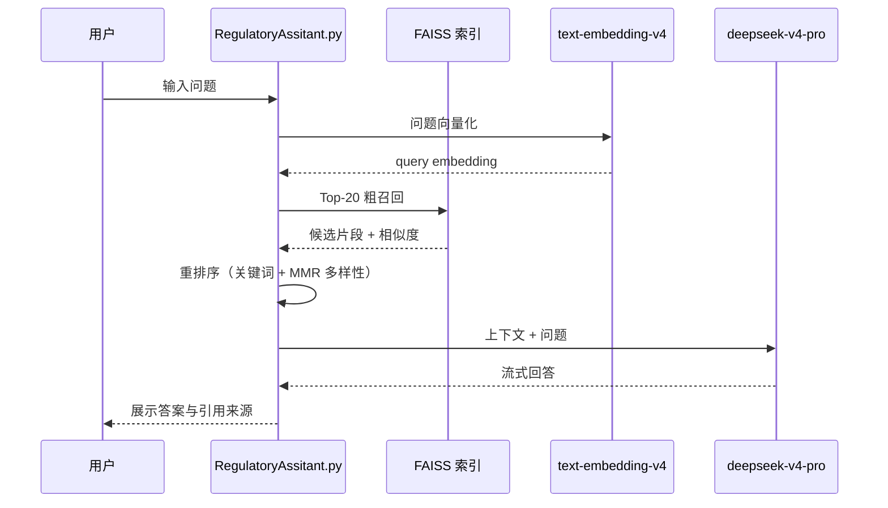

# 本地知识库问答系统（DeepSeek + FAISS）

基于 **FAISS 向量检索** 与 **DeepSeek 大模型** 的本地知识库问答（RAG）系统。知识库向量化与检索在本地完成，仅 Embedding 与对话生成调用阿里云百炼 API。

当前示例场景为**金融监管文件**合规问答，架构可复用于任意 PDF 文档库。

### 核心技术选型

| 环节 | 工具 / 模型 | 说明 |
|------|-------------|------|
| PDF 阅读 | [pypdf](https://pypi.org/project/pypdf/) | 纯 Python PDF 文本提取，轻量无系统依赖 |
| 文本嵌入 | `text-embedding-v4` | 百炼 Qwen3-Embedding，1024 维向量 |
| 对话生成 | `deepseek-v4-pro` | 百炼 DeepSeek，基于检索上下文回答 |
| 向量检索 | FAISS (`faiss-cpu`) | 本地持久化索引，余弦相似度召回 |

---

## 目录

- [系统架构](#系统架构)
- [技术栈](#技术栈)
- [目录结构](#目录结构)
- [环境准备](#环境准备)
- [快速开始](#快速开始)
- [RAG 流程详解](#rag-流程详解)
- [配置说明](#配置说明)
- [交互命令](#交互命令)
- [扩展自定义知识库](#扩展自定义知识库)
- [常见问题](#常见问题)

---

## 系统架构

```
┌─────────────────────────────────────────────────────────────────┐
│                        离线 / 本地                               │
│  ┌──────────────┐    ┌──────────────┐    ┌──────────────────┐   │
│  │  PDF 文档    │───▶│ pypdf 读取   │───▶│  FAISS 向量索引   │   │
│  │  知识库文件   │    │ + 文档切分    │    │  + metadata.pkl  │   │
│  └──────────────┘    └──────────────┘    └────────┬─────────┘   │
└───────────────────────────────────────────────────│───────────────┘
                                                    │ 余弦相似度检索
┌───────────────────────────────────────────────────▼───────────────┐
│                     百炼 OpenAI 兼容 API                           │
│  ┌─────────────────────┐              ┌─────────────────────┐    │
│  │ text-embedding-v4   │              │ deepseek-v4-pro     │    │
│  │ 问题向量化           │              │ 基于上下文生成回答    │    │
│  └─────────────────────┘              └─────────────────────┘    │
└───────────────────────────────────────────────────────────────────┘
```

**一次完整问答的流程：**



---

## 技术栈

| 组件 | 选型 | 说明 |
|------|------|------|
| PDF 阅读 | [pypdf](https://pypi.org/project/pypdf/) | 提取 PDF 页面文本，供切分与向量化 |
| 向量数据库 | [FAISS](https://github.com/facebookresearch/faiss) (`faiss-cpu`) | 本地持久化，支持余弦相似度检索 |
| 嵌入模型 | `text-embedding-v4` | 百炼 Qwen3-Embedding，1024 维，索引与检索须一致 |
| 对话模型 | `deepseek-v4-pro` | 百炼 DeepSeek，基于检索上下文生成回答 |
| API 接入 | OpenAI 兼容 SDK | `base_url` 指向百炼兼容端点 |

---

## 目录结构

```
A--Learning/
├── RAG/                                    # 问答模块（本目录）
│   ├── README.md                           # 本文档
│   ├── requirements.txt                    # 问答侧依赖
│   ├── RegulatoryAssitant.py               # RAG 命令行助手（主入口）
│   └── data/                               # 可选：待入库的原始文档
│
└── embedding/监管文件embedding测试/         # 向量索引构建模块
    ├── jianguan.py                         # 文档切分 + Embedding + FAISS 入库
    ├── requirements.txt                    # 构建侧依赖（含 pypdf）
    ├── 监管文件/                            # 原始 PDF 文档
    └── faiss_index/                        # 生成的索引产物
        ├── jianguan.index                  # FAISS 向量索引
        ├── metadata.pkl                    # 文本块元数据（与向量一一对应）
        └── config.json                     # 索引配置（向量数、模型、构建时间等）
```

> **注意：** 问答脚本默认读取 `embedding/监管文件embedding测试/faiss_index/` 下的索引文件，请先完成索引构建再启动问答。

---

## 环境准备

### 1. Python 版本

推荐 **Python 3.9+**（已在 3.8 / 3.10 下验证）。

### 2. 安装依赖

**构建索引（首次必做）：**

```bash
cd embedding/监管文件embedding测试
pip install -r requirements.txt
```

**运行问答：**

```bash
cd RAG
pip install -r requirements.txt
```

`RAG/requirements.txt` 内容：

```
openai>=1.0.0
faiss-cpu>=1.7.4
numpy>=1.24.0
```

构建索引还需额外安装：`pypdf`（见上方 embedding 目录的 requirements.txt）。

```bash
pip install pypdf>=4.0.0
```

### 3. 配置 API Key

系统通过阿里云百炼 OpenAI 兼容接口调用 Embedding 与 DeepSeek，需配置 **DashScope API Key**。

**方式一：环境变量（推荐）**

```bash
export DASHSCOPE_API_KEY="your-dashscope-api-key"
```

**方式二：写入 `~/.zshenv`**

```bash
export DASHSCOPE_API_KEY="your-dashscope-api-key"
```

读取优先级：`DASHSCOPE_API_KEY` → `OPENAI_API_KEY` → `~/.zshenv` 中的 export 语句。

> 请勿将 API Key 提交到 Git 仓库。

---

## 快速开始

### 第一步：构建 FAISS 向量索引

将 PDF 文档放入 `embedding/监管文件embedding测试/监管文件/`（或 `RAG/data/`），然后执行：

```bash
cd embedding/监管文件embedding测试
python jianguan.py
```

常用参数：

```bash
# 强制重建索引（文档有更新时使用）
python jianguan.py --rebuild

# 仅测试语义检索，不启动问答
python jianguan.py --search "理财产品销售有哪些监管要求？" --top-k 5
```

构建成功后，`faiss_index/` 目录下会生成：

- `jianguan.index` — FAISS 索引文件
- `metadata.pkl` — 每条向量对应的文本与来源信息
- `config.json` — 索引元信息（如向量条数、构建时间）

当前示例索引约含 **1286** 条向量（22 份监管文件，按章/节/条切分）。

### 第二步：启动知识库问答

**交互模式：**

```bash
cd RAG
python RegulatoryAssitant.py
```

**单次提问：**

```bash
python RegulatoryAssitant.py --query "银行保险机构数据安全管理有哪些要求？"
```

**静默模式（隐藏检索日志）：**

```bash
python RegulatoryAssitant.py --query "理财子公司净资本如何计算？" --quiet
```

启动后会显示索引状态，例如：

```
================================================================
  监管文件 RAG 助手 (Regulatory Assistant)
================================================================
  向量模型: text-embedding-v4
  对话模型: deepseek-v4-pro
  索引向量: 1286 条
  粗召回/重排: Top 20 -> Top 5
```

---

## RAG 流程详解

`RegulatoryAssitant.py` 每次回答前自动执行以下步骤：

### 1. PDF 入库（索引构建阶段）

使用 **pypdf** 逐页读取 PDF 文本，按章/节/条（或固定窗口）切分后，调用 **text-embedding-v4** 生成向量并写入 FAISS 索引。

### 2. 问题向量化（问答阶段）

调用 **text-embedding-v4** 将用户问题转为 1024 维向量，并对向量做 L2 归一化（与索引构建时一致，用于余弦相似度）。

### 3. FAISS 粗召回

在本地索引中检索 **Top 20** 最相似片段，返回相似度分数与元数据（文件名、章/节/条、正文）。

### 4. 查询后处理与重排序

| 步骤 | 说明 |
|------|------|
| 分数过滤 | 剔除相似度低于 0.55 的候选 |
| 去重 | 同一文件 + 同一条款只保留最高分 |
| 综合打分 | `0.70 × 向量分 + 0.30 × 关键词重合分` |
| MMR 多样性选择 | 避免上下文被内容高度重叠的片段占满，最终取 **Top 5** |

### 5. 上下文组装

将重排后的片段格式化为带引用信息的参考块，包含：来源文件、章/节/条定位、相关度、正文摘要（单条最多 800 字符，总量上限 6000 字符）。

### 6. DeepSeek 生成回答

将「参考片段 + 用户问题」送入 **deepseek-v4-pro**，系统提示词约束其：

- 优先引用具体条款并注明来源
- 依据不足时明确说明，不编造条款
- 使用简体中文、结构清晰

### 7. 多轮对话

保留最近 **6 轮** 纯问答历史（不含 RAG 上下文），支持连续追问。

---

## 配置说明

主要可调参数位于 `RegulatoryAssitant.py` 顶部：

| 参数 | 默认值 | 含义 |
|------|--------|------|
| `EMBEDDING_MODEL` | `text-embedding-v4` | 嵌入模型，须与索引构建时一致 |
| `EMBEDDING_DIM` | `1024` | 向量维度 |
| `CHAT_MODEL` | `deepseek-v4-pro` | LLM 对话模型 |
| `RETRIEVE_TOP_N` | `20` | FAISS 粗召回条数 |
| `RERANK_TOP_K` | `5` | 送入 LLM 的上下文条数 |
| `MIN_RETRIEVAL_SCORE` | `0.55` | 相似度下限 |
| `RERANK_VECTOR_WEIGHT` | `0.70` | 重排向量分权重 |
| `RERANK_KEYWORD_WEIGHT` | `0.30` | 重排关键词分权重 |
| `MMR_LAMBDA` | `0.65` | MMR 多样性系数（越大越重相关性） |
| `MAX_CHUNK_CHARS` | `800` | 单条上下文最大字符数 |
| `MAX_CONTEXT_CHARS` | `6000` | 上下文总字符上限 |
| `MAX_HISTORY_TURNS` | `6` | 多轮对话保留轮数 |

索引路径（如需修改）：

```python
FAISS_INDEX_DIR = PROJECT_ROOT / "embedding" / "监管文件embedding测试" / "faiss_index"
```

---

## 交互命令

在交互模式下除直接输入问题外，还支持：

| 命令 | 功能 |
|------|------|
| `/help` | 显示帮助 |
| `/clear` | 清空对话历史与引用记录 |
| `/refs` | 查看上一轮回答所引用的文档片段 |
| `quit` / `exit` / `退出` | 结束程序 |

`/refs` 输出示例包含：来源文件、章/节/条定位、向量分/关键词分/综合分、内容预览。

---

## 扩展自定义知识库

若要将本系统用于**非监管文件**的通用知识库，需调整索引构建脚本 `jianguan.py`：

1. **文档目录** — 修改 `DOC_DIR` 指向你的文档文件夹（或将文件放入 `RAG/data/` 后同步修改路径）。
2. **切分策略** — 当前按法规「章/节/条」结构化切分；普通文档可改为固定长度滑动窗口切分。
3. **元数据字段** — `metadata.pkl` 中每条记录至少包含 `text` 字段；建议增加 `display_name`（来源文件名）便于引用展示。
4. **重建索引** — 文档变更后执行 `python jianguan.py --rebuild`。
5. **Prompt 调整** — 修改 `RegulatoryAssitant.py` 中 `build_system_prompt()` 以匹配新领域（如内部制度、产品手册等）。

**Embedding 与索引构建必须使用同一模型和维度**，否则检索结果将不可用。

---

## 常见问题

### Q: 启动时报「未找到 FAISS 索引」

请先运行索引构建：

```bash
python embedding/监管文件embedding测试/jianguan.py
```

若已有索引但仍报错，检查 `faiss_index/jianguan.index` 与 `metadata.pkl` 是否同时存在。

### Q: 报「未找到 API Key」

确认已设置 `DASHSCOPE_API_KEY` 环境变量，或在 `~/.zshenv` 中添加 export 语句后重新打开终端。

### Q: 回答与问题不太相关

可尝试：

- 降低 `MIN_RETRIEVAL_SCORE`（如 `0.45`）以放宽召回
- 增大 `RETRIEVE_TOP_N`（如 `30`）扩大候选池
- 检查索引是否覆盖相关文档（用 `jianguan.py --search` 验证）
- 更新文档后执行 `--rebuild` 重建索引

### Q: 检索有结果但 LLM 说「未找到依据」

可能是重排后 Top-K 片段被过滤或截断。可增大 `RERANK_TOP_K` 或 `MAX_CONTEXT_CHARS`，并用 `/refs` 查看实际送入模型的引用。

### Q: Mac 上 faiss-cpu 安装失败

可尝试：

```bash
pip install faiss-cpu --no-cache-dir
# 或通过 conda
conda install -c conda-forge faiss-cpu
```

### Q: API 调用费用

- Embedding：按 token 计费，索引构建为一次性成本；每次问答仅对问题做一次向量化
- Chat：按 `deepseek-v4-pro` 的输入/输出 token 计费

详见 [阿里云百炼定价](https://help.aliyun.com/zh/model-studio/billing)。

---

## 相关脚本速查

| 脚本 | 路径 | 用途 |
|------|------|------|
| 索引构建 | `embedding/监管文件embedding测试/jianguan.py` | 文档入库、向量索引生成 |
| 语义检索测试 | 同上 `--search "问题"` | 验证索引质量 |
| RAG 问答 | `RAG/RegulatoryAssitant.py` | 交互式 / 单次问答 |

---

## License

与项目根目录保持一致（MIT）。
