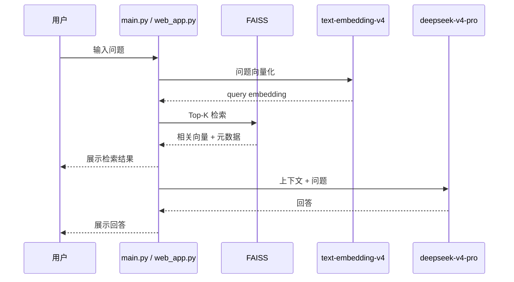

# 本地知识库问答系统（DeepSeek + FAISS）

基于 **FAISS 向量检索** 与 **DeepSeek 大模型** 的本地知识库问答（RAG）系统。向量化与检索在本地完成，Embedding 与对话生成调用阿里云百炼 API。

提供 **两套并行方案**：

| 方案 | 预处理 | 特点 | 适用场景 |
|------|--------|------|----------|
| **普通方法**（`Normal/`） | 规则递归字符切分 | 快、免费、稳定 | 批量入库、日常更新 |
| **LLM 方法**（`LLM/`） | deepseek-v4-pro 语义切分 | 按章节语义切分、带 title/summary | 结构复杂、重视检索质量 |

---

## 目录

- [核心技术选型](#核心技术选型)
- [项目结构](#项目结构)
- [整体流程](#整体流程)
- [环境准备](#环境准备)
- [快速开始](#快速开始)
- [中间结果说明](#中间结果说明)
- [问答入口](#问答入口)
- [云服务器部署](#云服务器部署)
- [脚本速查](#脚本速查)
- [常见问题](#常见问题)

---

## 核心技术选型

| 环节 | 工具 / 模型 | 说明 |
|------|-------------|------|
| PDF 阅读 | [pypdf](https://pypi.org/project/pypdf/) | 逐页提取文本，记录页码 |
| Word 阅读 | [python-docx](https://pypi.org/project/python-docx/) + textutil/LibreOffice | `.docx` 直接解析；`.doc` 优先系统工具转文本 |
| 文本嵌入 | `text-embedding-v4` | 百炼 Qwen3-Embedding，1024 维 |
| 对话生成 | `deepseek-v4-pro` | 百炼 DeepSeek，严谨自然回答 |
| 向量检索 | FAISS (`faiss-cpu`) | IndexFlatIP + L2 归一化，余弦相似度 |
| Web 界面 | Flask | 项目根目录 `web_app.py` |

> 支持 `.pdf` / `.docx` / `.doc`。Word 无真实页码时按约 1800 字切成伪页，供后续分批与引用。

---

## 项目结构

```
A--Learning/
├── web_app.py                    # Web 问答界面（浏览器访问）
├── requirements-web.txt          # Web 部署依赖
├── templates/index.html          # Web 前端页面
│
└── RAG/
    ├── README.md                 # 本文档
    ├── requirements.txt          # RAG 核心依赖
    ├── main.py                   # 命令行问答入口
    ├── data/                     # 原始 PDF 文档（入库源）
    │
    ├── processed/                # 方案 A 中间结果（JSON）
    │   └── *.preprocessed.json
    ├── processed/llm/            # 方案 B 中间结果（JSON）
    │   └── *.preprocessed.llm.json
    │
    ├── faiss_index/              # 方案 A 向量库
    │   ├── knowledge.index
    │   ├── metadata.pkl
    │   └── config.json
    ├── faiss_index/llm/          # 方案 B 向量库
    │
    ├── Normal/                   # 方案 A：普通方法
    │   ├── PreProcessed.py       # 步骤 1：pypdf + 递归字符切分
    │   ├── CreateIndex.py        # 步骤 2：Embedding + FAISS
    │   └── GetKnowledge.py       # 一键构建（步骤 1 + 2）
    │
    └── LLM/                      # 方案 B：LLM 语义切分
        ├── PreprocessLLM.py      # 步骤 1：pypdf + deepseek 语义切分
        ├── CreateIndex.py        # 步骤 2：Embedding + FAISS（--mode llm）
        └── GetKnowledgeLLM.py    # 一键构建（步骤 1 + 2）
```

---

## 整体流程

```
data/*.{pdf,docx,doc}
    │
    ├─【方案 A】Normal/GetKnowledge.py
    │     PreProcessed.py  →  processed/*.preprocessed.json
    │     CreateIndex.py   →  faiss_index/
    │
    └─【方案 B】LLM/GetKnowledgeLLM.py
          PreprocessLLM.py →  processed/llm/*.preprocessed.llm.json
          CreateIndex.py   →  faiss_index/llm/
                │
                ▼
          main.py / web_app.py
          检索 Top-K → 展示相关向量 → deepseek-v4-pro 回答
```


```mermaid
sequenceDiagram
    participant U as 用户
    participant W as main.py / web_app.py
    participant F as FAISS
    participant E as text-embedding-v4
    participant D as deepseek-v4-pro

    U->>W: 输入问题
    W->>E: 问题向量化
    E-->>W: query embedding
    W->>F: Top-K 检索
    F-->>W: 相关向量 + 元数据
    W-->>U: 展示检索结果
    W->>D: 上下文 + 问题
    D-->>W: 回答
    W-->>U: 展示回答
```

---

## 环境准备

### Python 版本

推荐 **Python 3.9+**。

### 安装依赖

```bash
# RAG 核心（构建索引 + 命令行问答）
cd RAG
pip install -r requirements.txt

# Web 问答（项目根目录）
cd ..
pip install -r requirements-web.txt
```

`RAG/requirements.txt`：

```
openai>=1.0.0
faiss-cpu>=1.7.4
numpy>=1.24.0
pypdf>=4.0.0
python-docx>=1.1.0
```

### 配置 API Key

```bash
export DASHSCOPE_API_KEY="your-dashscope-api-key"
```

或写入 `~/.zshenv`。读取优先级：`DASHSCOPE_API_KEY` → `OPENAI_API_KEY` → `~/.zshenv`。

> 请勿将 API Key 提交到 Git 仓库。

---

## 快速开始

### 1. 放入文档

将 `.pdf` / `.docx` / `.doc` 文件放入 `RAG/data/`（或其子目录）。

### 2. 构建向量库

**方案 A — 普通方法（推荐日常使用，速度快）：**

```bash
cd RAG/Normal
python GetKnowledge.py --rebuild
```

**方案 B — LLM 方法（语义切分，文档多时较慢）：**

```bash
cd RAG/LLM
python GetKnowledgeLLM.py --rebuild
```

`data/` 更新后，加上 `--rebuild` 重新执行上述命令即可。

### 3. 开始问答

**命令行：**

```bash
cd RAG
python main.py                  # 交互选择模式
python main.py --mode normal    # 普通方法
python main.py --mode llm --query "你的问题"
```

**Web 界面：**

```bash
cd ..   # 项目根目录 A--Learning/
python web_app.py
# 浏览器打开 http://127.0.0.1:443
```

---

## 中间结果说明

步骤一会产生 JSON 中间文件，**建议保留**，便于排查切分问题、单独重建索引。

| 方案 | 路径 | 内容 |
|------|------|------|
| 普通 | `processed/*.preprocessed.json` | 逐页文本 + chunks（含页码映射） |
| LLM | `processed/llm/*.preprocessed.llm.json` | 逐页文本 + 语义 chunks（含 title/summary） |

仅重建向量库、跳过预处理：

```bash
# 方案 A
cd RAG/Normal && python GetKnowledge.py --skip-preprocess --rebuild

# 方案 B
cd RAG/LLM && python GetKnowledgeLLM.py --skip-preprocess --rebuild
```

---

## 问答入口

### 命令行 `main.py`

| 参数 | 说明 |
|------|------|
| `--mode normal` | 使用 `faiss_index/` |
| `--mode llm` | 使用 `faiss_index/llm/` |
| `--query "问题"` | 单次提问 |
| `--top-k 5` | 检索条数 |

交互命令：`/refs` 查看上一轮检索结果，`quit` 退出。

### Web `web_app.py`

- 下拉切换普通 / LLM 知识库
- 每次回答**先展示检索到的相关向量**（相似度、来源、预览）
- 再展示助手回答（严谨、自然、不重复标注来源）
- 支持多轮对话、清空历史

---

## 云服务器部署

```bash
# 1. 上传代码，安装依赖
pip install -r RAG/requirements.txt
pip install -r requirements-web.txt

# 2. 配置 API Key
export DASHSCOPE_API_KEY="your-key"

# 3. 构建向量库（至少一种）
cd RAG/Normal && python GetKnowledge.py --rebuild

# 4. 启动 Web（监听外网，默认端口 443）
cd ../..   # 项目根目录
sudo python web_app.py --host 0.0.0.0 --port 443
```

生产环境推荐 gunicorn：

```bash
pip install gunicorn
sudo gunicorn -w 2 -b 0.0.0.0:443 web_app:app
```

安全组需放行对应端口（如 443）。绑定 443 在 Linux/macOS 上通常需要 root（`sudo`），或用 Nginx 反代到高端口。

### 如何保证服务一直运行（推荐）

直接 `python web_app.py` 容易挂：SSH 断开、终端关闭、进程异常退出后都不会自动恢复。请用下面任一方式。

#### 方式 A：一键后台启动（最快，路径自动跟随仓库）

```bash
cd /root/A--Learning          # 换成你的实际路径即可
pip install -r requirements-web.txt

# 建议把 Key 写进仓库根目录 .env（换机器也方便）
cp .env.example .env
# 编辑 .env 填入真实 Key

chmod +x scripts/start_web.sh
./scripts/start_web.sh --port 443

# 看日志 / 停止
tail -f logs/web_app.log
./scripts/start_web.sh --stop
```

脚本会自动识别当前仓库目录，并用 `python -m gunicorn`，不依赖固定路径。

#### 方式 B：systemd 开机自启 + 崩溃自动拉起（云服务器推荐）

```bash
cd /root/A--Learning          # 换成你的实际路径
cp -n .env.example .env && vi .env   # 填入 DASHSCOPE_API_KEY

chmod +x scripts/install_systemd.sh
sudo ./scripts/install_systemd.sh --port 443

systemctl status rag-web
journalctl -u rag-web -f
```

以后如果把项目挪到别的目录，进入**新目录**再执行一次 `sudo ./scripts/install_systemd.sh` 即可覆盖安装。

---

## 脚本速查

### 方案 A（Normal/）

| 脚本 | 用途 |
|------|------|
| `PreProcessed.py` | 仅 PDF 预处理 |
| `CreateIndex.py` | 仅构建 FAISS 索引 |
| `GetKnowledge.py` | **一键：预处理 + 索引** |

### 方案 B（LLM/）

| 脚本 | 用途 |
|------|------|
| `PreprocessLLM.py` | LLM 语义预处理（`--dry-run` 查看分批计划） |
| `CreateIndex.py --mode llm` | 读取 LLM 中间结果建索引 |
| `GetKnowledgeLLM.py` | **一键：LLM 预处理 + 索引** |

### 问答

| 脚本 | 用途 |
|------|------|
| `RAG/main.py` | 命令行问答 |
| `web_app.py` | Web 浏览器问答 |

---

## 方案对比

| 维度 | 普通方法 | LLM 方法 |
|------|----------|----------|
| 切分方式 | 递归字符（1000/200） | deepseek 语义切分 |
| 预处理速度 | 秒～分钟 | 分钟～数十分钟（文档越多越慢） |
| 预处理成本 | 无 API 费用 | 每批文档一次 LLM 调用 |
| 块质量 | 可能在句中切断 | 按章节/语义边界 |
| 额外字段 | 页码映射 | title、summary |
| 向量库路径 | `faiss_index/` | `faiss_index/llm/` |

---

## 常见问题

### Q: 启动问答时报「未找到 FAISS 索引」

先构建对应方案的向量库：

```bash
cd RAG/Normal && python GetKnowledge.py --rebuild
# 或
cd RAG/LLM && python GetKnowledgeLLM.py --rebuild
```

### Q: data/ 更新后如何重建？

```bash
python GetKnowledge.py --rebuild          # 方案 A
python GetKnowledgeLLM.py --rebuild       # 方案 B
```

### Q: LLM 预处理很慢，正常吗？

正常。每批文档需调用 deepseek-v4-pro，19 份 PDF 可能需要十几到几十分钟。日常更新建议用普通方法；LLM 方案适合少量重要文档。

### Q: Word 文档怎么处理？

已支持 `.docx`（python-docx）与 `.doc`（macOS `textutil` 或 LibreOffice `soffice`）。将文件直接放入 `data/` 后按原流程构建即可。若 `.doc` 解析失败，请安装 LibreOffice，或另存为 `.docx` / `.pdf`。

### Q: 报「未找到 API Key」

确认 `DASHSCOPE_API_KEY` 已设置，或在 `~/.zshenv` 中配置后重启终端。

### Q: Git 提交时注意什么？

- 在**项目根目录** `A--Learning/` 执行 `git commit`
- 不要提交 API Key
- 大体积索引（`faiss_index/`）和中间 JSON 可按需加入 `.gitignore`

### Q: Mac 上 faiss-cpu 安装失败

```bash
pip install faiss-cpu --no-cache-dir
# 或
conda install -c conda-forge faiss-cpu
```

---

## License

与项目根目录保持一致（MIT）。
